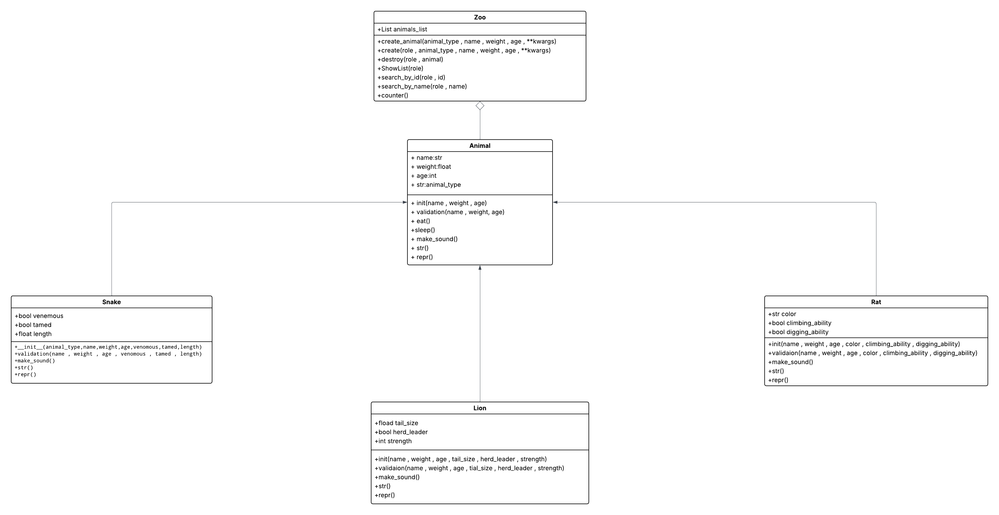

# zoo 
A zoo management system

## Description
This is a zoo management system implemented in Python using object-oriented programming principles.

# UML Diagrams
## Class Structure

## Features
- Animal management with inheritance
- No login for visitors
- Logging system for events
- save data in different formats

## Usage
Setup:
python cli.py

Operation list:
- login
    it ask you if you want to continue as admin or user
    in next step give admin user and password user

- add animal:
    get animal_type , name , type , weight and specify abilities
    and make an object with Animal type 

- delete animal
    get name of animal 
    and ask you to confirm you want to delete

- show all animal
    give you animals information

- search by the name
    get name of the animal you want

- search by the id
    get id of the animal you want 

- counting the number
    count animal of the list

- get log
    give you all of logs in logger file

## Permission System
The system implements role-based access control with:
Admin : Full acces to all operations
Visitor : Access to animal informations

